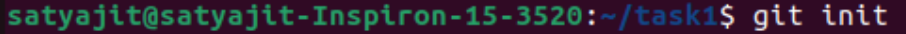
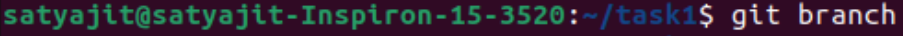
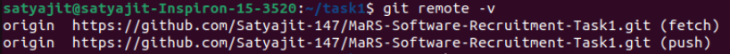
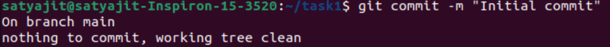
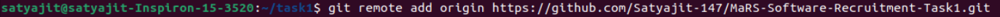
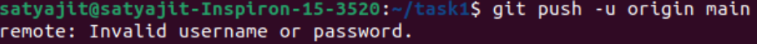

**# MaRS Task1**

**## Experience and Learnings**

Working with Git and GitHub using Linux commands was a hands-on experience. For this task, I successfully initialized a repository, pushed all python files to the repository and authenticated my GitHub using a Personal Access Token (PAT). I've solved 2 easy questions, 5 medium questions, and 1 hard question, which helped my revise my basic Python programming concepts.
Through this process, I learned:
- How to navigate directories and create new files using Linux commands
- Generate PAT for authentication instead of having to enter the password each time
- Troubleshoot common Git errors (Eg: Incorrect branch name
- Learnt file handling concepts in Python

**## Steps Taken to Push FIles to GitHub**
1. Initialize Git in the repository (Command: git init)

   
   

   **Description:** Creates a new Git repository within the directory (if not already initialized)
   

3. Check the Current Git Branch (Command: git branch)

   
   
   **Description:** Displays the active branch (main/master). If no branch exists, it defaults to main

5. List down the remote repositories (Command: git remote -v)

   
   
   **Description:** Displays the remote repository URLs linked to your local Git repository, showing both fetch and push destinations.

7. Add files (Command: git add .)

   
   
   **Description:** Adds all the files in the current directory to the staging area, preparing them for commit
   

9. Commit the Changes (Command: git commit -m "Initial commit")

    
   
   **Description:** Saves the changes made with a description (message) "Initial commit"
   

10. Link Local Repository to GItHub repository (Command: git remote add origin https://github.com/Satyajit-147/MaRS-Software-Recruitment-Task1.git)

    
   
   **Description:** This command is to connect local Git repository to a remote GitHub repository

11. Push Files to GitHub (Command: git push -u origin main)

    
   
   **Description:** The command uploads the committed changes from local repository to the remote repository on GitHub. -u enables pushing to be done without specifying the active branch

**## EASY DOSE**

**###Bash Scripting**
For this task, I generated a random number between 0 and 100 for the battery level using the command RANDOM%101, followed by two if conditions. The first condition checks if the battery level is below 20% and displays an appropriate error message if the condition is met. The second condition pings google.com to check network connectivity. If both checks pass, the script prints "All systems operational"; otherwise, it exits with an error message.

**## MEDIUM DOSE**

**### Task1**

The task was to determine the adjusted coordinates of the Rover Brick. According to the problem, the rover made a 360-degree turn 55 cm behind the actual mark. To correct its position, I first calculated the direction vector from the initial reference point to the final position. Then, I computed the unit vector, multiplied it by 55, and added the result to the final rover coordinates to obtain the corrected position. The initial reference frame and the rover’s final position before adjustment are taken as input from the user.

Concepts: Coordinate geometry and Vector calculation.

**### Task2**

The task was to convert Morse code into words. I used a dictionary where Morse code characters serve as keys and their corresponding alphabetic conversions as values. First, the input is split into words, and then each word is further split into individual letters. The corresponding conversion is retrieved using the dictionary. Finally, the resulting string is printed within a void function. The function takes the input Morse code as a parameter and prints the converted alphabetic version.

Concepts: Dictionary data structure, String manipulation and loops.

**### Task3**

I was tasked with shifting each character in the input string based on its position to decrypt a message. For example, if the first character is 'N', it is shifted to 'M', and a similar approach is used to decrypt all the characters in the string. To solve this, I set up a dictionary with letters as keys and their corresponding positions in the alphabet as values. I also created a reversed dictionary to retrieve the keys (letters) using their numerical values. Using loops, I appended the decrypted characters to the list letters_decrypted.

One issue I encountered during this process was the index going out of range (negative values). To address this, I incremented the resulting value by 26 if it became negative, ensuring it remained within the valid range of the alphabet. Finally, I printed the decrypted message using print(''.join(letters_decrypted)).

Concepts: Dictionaries, String Manipulation, Loops and Index Handling

**### Task4**

The task was to apply two different filters to the sensor readings (Muchiko and Sanchiko filters). The window size is provided as input by the user. Slicing techniques are used to retrieve a sublist of sensor readings, which is stored in a temporary list within the loop.

-For the Muchiko filter, the average of the temporary list is calculated and appended to the output list.

-For the Sanchiko filter, the median of the temporary list is calculated and appended to a second output list.

The built-in statistics module is imported to compute the standard deviation for both filtered lists. The filter that results in a smaller standard deviation is considered the better option.

Concepts: Slicing Techniques, Loops, Mathematical Operations, List manipulations and the in-built statistics module

**### Task5**

The task was to convert 3-number system to 4-number system. The 3-number system refers to Euler Angle, which represents the angles made with x-axis (Roll (ϕ)), y-axis (Pitch (θ)) and z-axis (Yaw (ψ)). The 4-number system refers to quaternions, a mathematical representation of rotations using four numbers (w, x, y, z). w is the scalar component (cosine of the half angle rotation angle) and (x,y,z) is the vector component (sine of half the rotation angle multiplied by the axis of rotation).

Conversion from Euler Angles to Quaternions:

-w = cos2ϕ​cos2θ​cos2ψ​+sin2ϕ​sin2θ​sin2ψ​

-x = sin⁡ϕ2cos⁡θ2cos⁡ψ2−cos⁡ϕ2sin⁡θ2sin⁡ψ2

-x = sin2ϕ​cos2θ​cos2ψ​−cos2ϕ​sin2θ​sin2ψ​

-y = cos⁡ϕ2sin⁡θ2cos⁡ψ2+sin⁡ϕ2cos⁡θ2sin⁡ψ2

-z = cos2ϕ​cos2θ​sin2ψ​−sin2ϕ​sin2θ​cos2ψ​

Gimbal lock is a phenomenon in 3D rotation systems, specifically when using Euler angles, where a loss of one degree of freedom occurs when two axes of rotation become aligned, leading to unpredictable and undesirable rotations.

In the context of rover navigation and positioning, avoiding gimbal lock is essential because the rover relies on accurate orientation adjustments to align with terrain, execute turns, and maintain stability. If gimbal lock occurs, one axis of rotation effectively disappears, making it impossible to properly adjust the rover's orientation. This can lead to incorrect navigation, failed maneuvering, or even complete loss of control over the rover’s direction.

Concepts: 3D rotations, 3-number and 4-number systems and Gimbal Lock.

**# #HARD DOSE**

**### Task1**

I was tasked with representing the obstacle positions in an arena. To solve this, I read the text file sample.txt and stored the data in a nested list. I used NumPy, a built-in module, to print an 11×11 arena. Then, I calculated the position of each obstacle, where N/S movement corresponds to the y-direction and E/W movement corresponds to the x-direction. I assumed that the rover starts from (0,0) in the arena for the question.

One issue I encountered was that the rover had to move north from its reference point, which was not possible to represent in the grid. To address this, I shifted the x and y coordinates of all obstacles where necessary. Specifically, I identified the obstacle with the smallest x and y coordinates and shifted every coordinate accordingly if these values were negative. This shifting method ensured that all obstacles could be properly represented within the arena matrix.

Concepts: NumPy for 2D array represenetation, Nested Lists, Coordinate System and Transformations.

